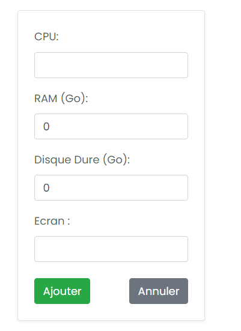

# Gestion des Ressources Matérielles

## Description
Ce logiciel est conçu pour gérer les ressources matérielles des départements de la faculté, permettant une communication fluide entre les départements, les responsables, le service de maintenance et les fournisseurs. L'accès aux services est sécurisé pour tous les utilisateurs.

## Fonctionnalités
1. **Gestion des appels d'offre** : 
   - Soumission des besoins matériels par les départements.
   - Appels d'offres centralisés pour l'acquisition de ressources.
  
2. **Gestion des fournisseurs** : 
   - Inscription et consultation des appels d'offres.
   - Soumission des propositions par les fournisseurs.
  
3. **Gestion des ressources** :
   - Attribution des ressources aux départements.
   - Suivi des livraisons et gestion des inventaires.

4. **Maintenance des ressources** :
   - Signalement des pannes par les enseignants.
   - Intervention des techniciens de maintenance.

## Besoins Fonctionnels
- Gestion des utilisateurs (enseignants, responsables, fournisseurs, techniciens).
- Suivi des demandes et des livraisons.
- Notifications pour les approbations et les rejets d'offres.
- Gestion des problèmes de maintenance.

## Screenshots
Voici quelques captures d'écran du logiciel :

1. **Ajouter Demande**
   

2. **Ajouter Ordinateur**
   

3. **Besoins**
   

4. **Créer Appel d'Offre**
   

5. **Liste des Demandes**
   

6. **Liste des Ressources**
   

7. **Liste Noire**
   

8. **Livraison**
   

9. **Login**
   

10. **Modifier Demande**
    

11. **Registration**
    

12. **Responsable**
    

## Installation
Pour cloner le projet, utilisez la commande suivante :

```bash
git clone https://github.com/hananebouchouikra189/Ressources-Management.git
